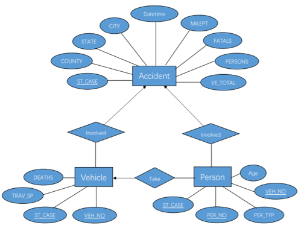

# Traffic-Safety-in-US-database
**Course**: 12741

**Group TOPIC** : Traffic Safety in the US

**Group Member**: Mengmeng Pan; Yuanpeng Cao; Peng Zeng

## Introduction
### Motivation
Traffic safety has become a serious problem worldwide for a long time. Crash is a main topic related to traffic safety. There are about 3 million people in the U.S. are injured every year in car accidents and more than 90 people die in these car accidents every day[1]. In addition, these crashes result in 6% fatality[1]. Therefore, the level of number of the fatalities and deaths related on crashes and how drivers’ condition, vehicles’ condition and weather condition impact on fatalities are worth investigating.

### Objective
The primary objective of the project is to reduce the occurring of car crashes and to reduce the injured people in crashes. Through creating an accurate database, it is convenient for everyone to attain details of each car accident. The purpose of creating the database is to attain results and conclusions about the cause of a car accident and to predict fatalities under a particular condition. In this case, it is possible to reduce the number of fatalities in crashes, seriousness of injured and losses of economic. Through answering the research questions, we could assess and develop the traffic safety and benefit both drivers and passengers’ safety in the same time. In this report, we task our database by holding a research question about analyzing several factors on fatalities.  

### Data Source
The crash datasets are distributed by the U.S. Department of Transportation, National Highway Traffic Safety Administration at the URL ftp://ftp.nhtsa.dot.gov/fars/2016/National/. Several raw datasets contain information about accidents, vehicles involved in crashes and drivers involved in crashes respectively. Therefore, the database should have the basic circumstance of each qualified crashes occurred within the 50 States in the US in 2016. Each crash should involve vehicles traveling in a trafficway and result in at least a death of people who involved in the crash in anyway within 30 days from the day of crash occurred. 

## Database Design and E-R Diagram

### Database Design
The purpose of our database is to attain the basic information of drivers, vehicles, accidents involved in each crash. The primary goal is to collect information from three entities and each entity have several attributes which describe the entity in more detail. Moreover, it is necessary to pay attention to the relationship between different entities and guarantee anyone could attain the information from the database with a clear image. 

* Introduction of Separated Datasets The accident dataset involved several details about crashes. The attribute “ST_CASE” is the unique number of each crash. In the accident dataset, there is not the same “ST_CASE”, which means it could be the key primary of this dataset. The attribute “CITY”, “COUNTY” and “STATE” represent the general location of crash happened and each code of these attribute accord with the worldwide Geographic Location Code(GLC). The attribute “MONTH”, “DAY” and “HOUR” record the datetime of crashes occurred. The attribute “MILEPT” represents the mile point nearest to the location where crashes occurred. The attribute “FATALS” records the number of fatal injured people involved in each crash. The attribute “PERSONS” and “VE_TOTAL” show the number of person and the number of vehicles involved in a singe crash respectively. 

The vehicle dataset records information of vehicles which involved in a car accident. The attribute “ST_CASE” is the unique number of each crash, which is the same as in accident dataset. However, there might be several same “ST_CASE” in this dataset as several vehicles might be involved in a single crash. The attribute “VEH_NO” means the serial number of vehicles involved in a crash. The “VEH_NO” start from 1 and it is the unique number of each vehicle in a crash. Therefore, the combination of attribute “ST_CASE ” and “VEH_NO” should be the primary key of each vehicle. Besides, “TRAV_SP” and “DEATHS” record the travel speed of each vehicle when crash occurred and the number of death(s) in a vehicle. 

The person dataset records details about person level in crashes. The attribute “ST_CASE” means the unique serial number of crashes, which is the same as in accident and vehicle dataset. However, there might be several same “ST_CASE” in this dataset as several persons might be taking in a vehicle and several vehicles might be involved in a single crash. Therefore, the combination of attribute “ST_CASE ”, “VEH_NO” and “PER_NO” should be the primary key of each person. In addition, “PER_TYP”  is a category type of attribute which represent the role of person in the crash. For example, “1” means the driver of a vehicle and “2” means passenger of a vehicle. The attribute “AGE” records the age of each person. 

* Relationship of Datasets The same attribute between accident dataset, vehicle dataset and person dataset are all “ST_CASE”, which means we could match each two datasets with each other by this same attribute. 

### E-R Diagram 
Entity Relationship Diagram(E-R Diagram) is a diagram used for a clear database design. The principle of designing an E-R Diagram is to clearly show the information in a database and the relationship among components.[slides in Lecture4]

Entities are represented by rectangle. The properties of each entity contain more detail about entity. The relationship between entity sets are represented by diamonds and there are four types of binary E-R relationship, which are one-to-one, one-to-many, many-to-one and many-to-many. 

Based on the principle of designing E-R diagram, the E-R Diagram of our database is shown in Figure 1. 
<p align="center">
  
</p>
<p align="center">
  Figure 1: E-R Diagram of database
</p>

In Figure 1, three entities which are called “Accident”, “Vehicle and” and “Person” represented by rectangle. Several vehicles might be involved in an accident and several accidents must involve many vehicles so the arrow should point to the Accident entity. Several persons might take in a vehicle and many vehicles must involve in many persons so the arrow should point to the vehicle. An accident might be involved in many persons and one person must be involved in an accident so the arrow should point to the Accident entity. Attributes of each entity are represented by ovals, which are the same as attributes in each dataset. 

## Factors on Fatalities in Car Crashes
### Relationship of Speed and Fatalities
We use linear regression, find the best fitting parameter vector w ̂=[α,β].  First, we clean all data and build a table named vehicle, totally 13602 rows of data. Then, we build a relationship of vehicles ‘highest speed(mph) and the number of deaths in the accident.
                                                                
Where y_i is sample data of death in one accident, x_i is speed data, n_i is noise, α and  β are linear regression function parameters.
* Outliers Detection By using the formula below, we can get all the outliers we should remove.
                      
Where y_i is sample data of death in each accident, u is mean of deaths and σ is the sample of all death data. 
Totally, we locate 107 outliers by repeat the process above several times.   

* Linear Function After removing the outliers, we have 13495 rows of data. In this case, we set up the number of deaths as respond and speed as prediction. After applying linear regression, we calculate the relate parameter.

Then we can identify the model.

The parameter α ̂ is positive, which means the death in the accident will increase along with the increment of the speed of vehicles and vice versa. We can use this identified model to make some prediction.  When the speed goes up to 151mph, the average number of deaths would get to 1.59. 

### Age of Drivers Impact on Fatalities

Age is the human’s unchangeable attribute. With the time goes by, age will increase. However, when the age increases, people’s physical abilities will decrease, especially the ability to response and the ability to judgement. As we all know, driving need the drivers concentrate on the road carefully. In case some accident happens, the driver needs to make a quick reflection as soon as possible. Therefore, our group argue that the fatalities have some relationships with the age of the driver. To figure out what the relationship is, we make a bar chart to deal with the problem.
We collect the data from the database and select the column called AGE. We find out that there are some 998 and 999 in the data. Looking for the codebook, they are not the data we need. Therefore, we clean the data and remove the error number. We separate the ages spaced at 10. Then, we count the total number of each age range to represent the number of accidents at different age ranges. After that, we use the excel to make the bar chart and create the trendline. As the graphic shown below:

From the graphic above, we can know that the trendline is the fourth power line. The age ranges from 20 to 30 has the largest number of the fatalities, which is the maximum. In our opinion, the reason why this happen is that at this age range, most of them are young people, they are easier to get angry and lose temper. Also, we find that the legal driving age in most states are 16. So, when most of the twenties own a car for the first time in their lives, and the excitement makes them ignore the safety of transportation. That is why the age in twenties has the large number of fatalities. When people go in their 30s, 40s and 50s, you can see the number decreases step by step. We think this is because people at these periods have a stable job, they are unavoidable to use vehicle. Although there are many accidents happening in the whole country, the rate of accident happening per person is stable. So, the numbers of these three ranges look the same. And the age below 20s and above 60s, the number is lower. That is because they don’t always depend on vehicles. To sum up, the conclusion is that the age ranges from 20 to 50 have the largest number of fatalities.

##Discussion and Conclusion

Nowadays, with the society and economy development, more and more families have their own vehicles. America is the country with the largest car ownership. The more cars we own, the more accidents will happen. Traffic safety becomes more and more important than before. Therefore, in order to make a research about the traffic, our group use the knowledge we learn in 12741 to make a database and try to use it to solve some problems we ask. Firstly, we download the raw data from the US NHTSA (National Highway Traffic Safety Administration) website. From the raw data, we select three kinds of csv file, which are “ACCIDENT.csv”, “PERSON.csv” and “VEHICLE.csv”. Next, we use our knowledge of E-R diagram to make the E-R diagram. After doing above, we select some kinds of data, clean them and then insert them into SQL with python to make our own database. For each problem, we select the raw data we want, such as the age problem. We select the column called AGE and make the analysis. In cleaning the data, we use the python to write the programming to clean the outliers. In the analyzing data, we use the linear regression. To sum up, we hope our database will be useful to others to solve their problems.

## REFERENCES
[1]https://www.driverknowledge.com/car-accident-statistics/

[2]Data processing for time series, Mario Berges.

https://canvas.cmu.edu/courses/12033/files/folder/lectures/Lecture%203?

[3]Entity Relationship Diagrams and Set Theory, Mario Berges

https://canvas.cmu.edu/courses/12033/files/4131412?module_item_id=3760601

## APPENDIX

### Code for operation of MySQL
```
import pymysql
import pandas as pd

# connect mysql and database
config = dict(host='localhost', user='root', password='cao6996057',cursorclass=pymysql.cursors.DictCursor,db="localhost")
# connection
conn = pymysql.Connect(**config)
# commit True
conn.autocommit(1)
# set up curspr
cursor = conn.cursor()

df = pd.read_csv('person-clean.csv', encoding='gbk', usecols=[0,1,2,3,4] )

def csv2mysql(db_name, table_name, df):
        # build database
        cursor.execute('CREATE DATABASE IF NOT EXISTS {}'.format(db_name))
        # choose database
        conn.select_db(db_name)
        # build table
        cursor.execute('DROP TABLE IF EXISTS {}'.format(table_name))
        cursor.execute('CREATE TABLE {}({})'.format(table_name,make_table_sql(df)))
        
        values = df.values.tolist()
        # read the number of cols
        s = ','.join(['%s' for _ in range(len(df.columns))])
        # executemany multiple operation
        cursor.executemany('INSERT INTO {} VALUES ({})'.format(table_name,s), values)


def make_table_sql(df):
    columns = df.columns.tolist()
    types = df.ftypes
    # add id and primary key
    make_table = []
    for item in columns:
        if 'int' in types[item]:
            char = item + ' INT'
        elif 'float' in types[item]:
            char = item + ' FLOAT'
        elif 'object' in types[item]:
            char = item + ' VARCHAR(255)'           
        elif 'datetime' in types[item]:
            char = item + ' DATETIME'            
        make_table.append(char)
    return ','.join(make_table)

csv2mysql(db_name='localhost',table_name='person' ,df=df)

# some operation to  set up primary key read,add, delete, update data from the database
def set_primary_key():
    alter table person add primary key (ST_CASE, PER_NO)

def selectData(): 
    cursor.execute("SELECT TRAV_SP,DEATHS FROM vehicle ")
    for row in cursor:
        for key in row:
            print (key + ": " + str(row[key]),)
            print()

    cursor.execute('SELECT * FROM person LIMIT 5')

def DeleteRecord():
    cur.execute("DELETE FROM preson WHERE age <10")

def UpdateRecord():
    cur.execute("UPDATE book SET FATALS=2 where MILEPT >3000")

cursor.close()
conn.close()
```

### Code for Outliers 
```
import numpy as np
import matplotlib.pyplot as plt
import xlwt
data = np.genfromtxt('speed.txt',delimiter=',') #delimiter: the str used to separate data. 
speed=data[:,0]
death=data[:,1]
do =True

while do:
    do=False
    mean=np.mean(death)
    deathminusmean=(death-mean)
    sresult=[]
    for element in deathminusmean:
        squr=element**2
        sresult.append(squr)
    deathminusmeansqur=np.array(sresult)
    sumnum=sum(deathminusmeansqur)
    samplev=(sumnum/(len(death)-1))**0.5

    di=abs(death-mean)/samplev
    result=[]
    speedlist=[]
    for index in range (len(di)):
        if di[index] <=3:
            result.append(death[index])
            speedlist.append(speed[index])
        else:
            do=True
    death=np.array(result)
    speed=np.array(speedlist)

```

### Code for Linear Regression 
```
import numpy as np
import matplotlib.pyplot as plt
import xlwt
import out

# get y=Death , x=speed
one=np.ones(len(out.speed))
A=np.c_[out.speed,one]

AT=A.T
TEMP=(AT.dot(A))
tem=np.linalg.inv(TEMP)
Aplus=(tem.dot(AT))

w=Aplus.dot(out.death)
q=A.dot(w)

r=out.death-q

def write_excel_xls(path, sheet_name, r,):
    workbook = xlwt.Workbook()  # build a new work sheet
    sheet = workbook.add_sheet(sheet_name)  # new table in the work sheet
    j = 0
    for i in r:
        sheet.write(j,0,i) #iterate the row
        j=j+1
    j = 0
    for i in out.death:
        sheet.write(j,1,i) 
        j=j+1
    j = 0
    for i in out.speed:
        sheet.write(j,2,i) 
        j=j+1
    workbook.save(path)  # save the work sheet
    print("xls save successfully  ！")


book_name_xls = 'xlstest.xls'

sheet_name_xls = 'xlsheet1'
value_title=r
write_excel_xls(book_name_xls, sheet_name_xls, value_title)
```

